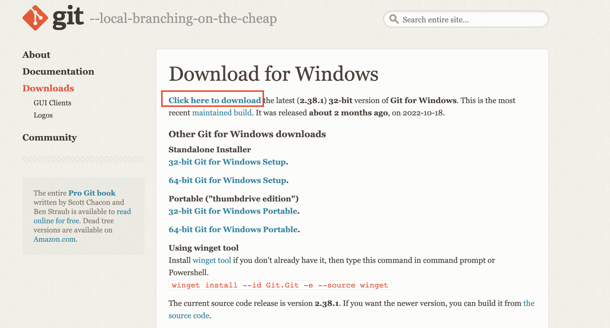
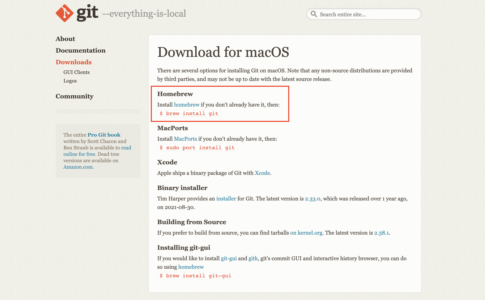
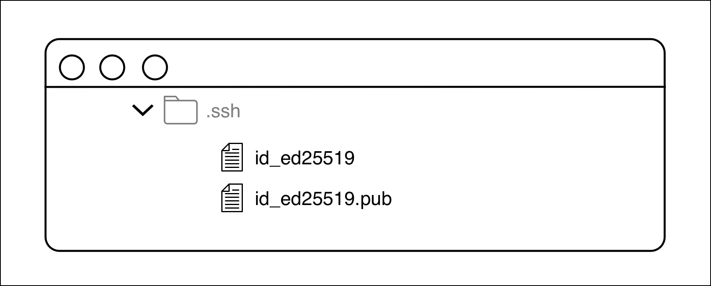

# GitHub Repository for Learning Git by Anna Skoulikari

This GitHub repository is meant to be used as a supplementary resource for Learning Git: A Hands-on Approach to Understanding the Basics of Git by Anna Skoulikari.

## Table of Contents:

- [(Chapter 1) Installing Git for Microsoft Windows](#installing-git-for-microsoft-windows)
- [(Chapter 1) Installing Git for macOS](#installing-git-for-macOS)
- [(Chapter 6) Create a personal access token in GitHub](#create-a-personal-access-token-in-github)
- [(Chapter 6) Create an app password in Bitbucket](#create-an-app-password-in-bitbucket)
- [(Chapter 6) Set up SSH access](#set-up-SSH-access)
- [(Chapter 7) Create a remote repository](#create-a-remote-repository)
- [(Chapter 12) Creating a pull request (merge request)](#create-a-pull-request-merge-request)

## Installing Git for Microsoft Windows

To install Git, go to the official Git website downloads page for Microsoft Windows [https://git-scm.com/download/win](https://git-scm.com/download/win). This page presents several ways you can download Git.

For the Learning Git book, we recommend you use the first and main download option to install Git which provides an installer. To do so, select the **Click here to download** link. This will download an installer that you will use to go through the step-by step installation process. You should accept all the default settings as you go through the installer.

By using this download option to install Git, you will also have a version of Git installed which is definitely greater than 2.23 which is the minimum version we recommend in order to have access to all the commands in this book.

The installer will go through step-by step instructions to take you through the installation process. You should accept all the default settings as you go through the installer. In Follow Along #-#, we present the 13 steps the installer will go through and instruct you to select the default options.

|     | Follow Along #-#                                                                                                                 |
| --- | :------------------------------------------------------------------------------------------------------------------------------- |
| 1   | On the **Select Destination Location** screen, accept the default location and select **Next**.                                  |
| 2   | On the **Select Components** screen, accept the default location and select **Next**.                                            |
| 3   | On the **Select Start Menu Folder** screen, accept the default location and select **Next**.                                     |
| 4   | On the **Choosing the default editor used by Git** screen, accept the default location and select **Next**.                      |
| 5   | On the **Adjusting the name of the initial branch in new repositories** screen, accept the default location and select **Next**. |
| 6   | On the **Adjusting your PATH environment** screen, accept the default location and select **Next**.                              |
| 7   | On the **Configuring the line ending conversions** screen, accept the default and select **Next**.                               |
| 8   | On the **Configuring the terminal emulator to use with Git Bash** screen, accept the default and select **Next**.                |
| 9   | On the **Choose the default behavior of `git pull`** screen, accept the default and select **Next**.                             |
| 10  | On the **Choose a credential helper** screen, accept the default and select **Next**.                                            |
| 11  | On the **Configuring extra options** screen, accept the default and select **Next**.                                             |
| 12  | On the **Configuring experimental options** screen, accept the default and select **Next**.                                      |
| 13  | On the **Completing the Git Setup Wizard** screen, select **Finish**.                                                            |

Now that you have finished going through the steps of the installer you should have Git installed on your computer. To check whether Git successfully installed, you should open a Git Bash command line window and use the git version command to check what version of Git you have installed on your computer. Let’s do this in Follow Along #-#.

|     | Follow Along #-#                                                                 |
| --- | :------------------------------------------------------------------------------- |
| 1   | Search for the Git Bash command line application and open a command line window. |
| 2   | \$ **`git version`** `git version 2.38.1.windows.1`                           |

What to notice:

- The output of the `git version` command shows you what version of Git you have installed on your computer.

You have completed Git installation.

## Installing Git for macOS

([back to table of contents](#table-of-contents))

To install Git, go to the official Git website downloads page for macOS [https://git-scm.com/download/mac](https://git-scm.com/download/mac). This page presents several ways you can download Git.

For the Learning Git book, we recommend you use Homebrew to install Git.

By using Homebrew to install Git, you will also have a version of Git installed which is definitely greater than 2.23 which is the minimum version we recommend in order to have access to all the commands in this book.

To install Git using Homebrew, you must have Homebrew installed. If you don’t have Homebrew installed then go to Follow Along #-#.

|     | Follow Along #-#                                                                                                                                                                                             |
| --- | :----------------------------------------------------------------------------------------------------------------------------------------------------------------------------------------------------------- |
| 1   | Go to the Homebrew website [https://brew.sh/](https://brew.sh/) and copy the command to install Homebrew.                                                                                                    |
| 2   | Open a command line window and paste the command to install Homebrew where the cursor is. The directory location in the command line is not important when you execute this command in step 3.               |
| 3   | \$ <strong>`/bin/bash -c "$(curl -fsSL https://raw.githubusercontent.com/Homebrew/install/HEAD/install.sh)"`</strong> `===> Checking for sudo access (which may request your password)...` `Password:` |
| 4   | When the command prompts you to enter a password, enter the password for your user on your computer.                                                                                                         |
| 5   | To complete the installation press Enter.                                                                                                                                                                    |
| 6   | \$ **`brew --version`** `Homebrew 3.6.7` `Homebrew/homebrew-core (git revision 4917c76d4d2; last commit 2022-10-29)`                                                                                   |

What to notice:

- In step 6, the output should show what version of Homebrew you have installed.

Now that Homebrew is installed, the next step is to install Git. In order to do that, you will use the `brew install git` command. And afterwards, you will use the `git version` command to check what version of Git you installed on your computer. Let’s carry all of this out in Follow Along #-#.

|     | Follow Along #-#                             |
| --- | :------------------------------------------- |
| 1   | \$ **`brew install git`**                    |
| 2   | \$ **`git version`** `git version 2.38.1` |

You have completed Git installation.

## Set up authentication credentials to connect over HTTPS

## Create a personal access token in GitHub

([back to table of contents](#table-of-contents))

In Chapter 6 of Learning Git, you are instructed to choose a hosting service and set up authentication details to connect to remote repositories over the HTTPS or SSH protocols. If you choose to use the HTTPS protocol and you are using GitHub, you must create a personal access token.

The instructions for how to create a personal access token in GitHub are available at: [GitHub Docs - Creating a personal access token](https://docs.github.com/en/authentication/keeping-your-account-and-data-secure/creating-a-personal-access-token).

When creating the personal access token in GitHub, keep in mind the below notes:

- The Note field represents the name for the personal access token
- When selecting an expiration time, we recommend choosing at minimum a time period within which you can finish reading and doing the exercises in the entire book. Otherwise, your personal access token may expire while you're going through the book and you will have to go through the process to create a new one to complete the exercise in the book.
- The scope defines what this token will have access to do or authenticate. For the purpose of this book, you must select at least the repo scope.
- Save the personal access token in a safe place.

> Note: Once you create the authentication credential, for security reasons, you will only see it once. Therefore, you must save it in a secure place. Afterwards, you will only be able to see some details about it, but not the authentication credential itself.

## Create an app password in Bitbucket

([back to table of contents](#table-of-contents))

In Chapter 6 of Learning Git, you are instructed to choose a hosting service and set up the authentication details to connect to remote repositories over the HTTPS or SSH protocols. If you choose to connect over HTTPS and you are using Bitbucket, you must create an app password.

The instructions for how to create an app password in Bitbucket are available at: [Bitbucket Support - Create an App password](https://support.atlassian.com/bitbucket-cloud/docs/create-an-app-password/).

When creating an app password in Bitbucket: keep in mind the below notes:

- The Label field represents the name for the app password.
- The permissions describe what this app password will be able to authenticate. For the purposes of this book you should select at least the options under the sections, Account, Workspace membership, Projects, Repositories, and Pull Requests.
- Save the app password in a safe place.

> Note: Once you create the authentication credential, for security reasons, you will only see it once. Therefore, you must save it in a secure place. Afterwards, you will only be able to see some details about it, but not the authentication credential itself.

## Set up SSH access

([back to table of contents](#table-of-contents))

In Chapter 6 of Learning Git, you are instructed to choose a hosting service and set up authentication details to connect to remote repositories over the HTTPS or SSH protocols. If you choose to set up SSH access, then you may use the links below that provide instructions on how to do this for each hosting service.

GitHub

- [GitHub Docs - Connecting to GitHub with SSH](https://docs.github.com/en/authentication/connecting-to-github-with-ssh)

GitLab

- [GitLab Docs - Use SSH keys to communicate with GitLab](https://docs.gitlab.com/ee/user/ssh.html)

Bitbucket

- [Bitbucket Support - Set up an SSH key](https://support.atlassian.com/bitbucket-cloud/docs/set-up-an-ssh-key/)

### Example

I will provide a general example with additional notes, however if you get stuck or the general example does not apply in your case, then I recommend consulting the official hosting service documentation

The three main steps to setting up SSH access are:

1. Create an SSH key pair on your computer
2. Add the private SSH key to the SSH agent
3. Add the public SSH key to the hosting service account.

#### Step 1: Create an SSH key pair on your computer

There are different types of SSH keys, some are considered safer than others and each hosting service documents which SSH key types it accepts.

As of writing this book, an SSH key type that is accepted by all three major hosting services and which is considered the safest is `ed25519` therefore this is the type that we will use in the Rainbow project example in this book. However, you may choose to use another type as long as it is accepted by your hosting service of choice.

The command you will use to create the SSH key pair is the `ssh-keygen -t <ssh-key-type> -C “<email>”`. The `-t` option stands for “type” and the `-C` option indicates the label. You will use the email you use for your hosting service account as the label.

Once you execute this command, you will be prompted to save the keys in the default location. The default location will be in your current user directory which as we mentioned in Chapter 1 is indicated by the tilde ~ sign. In this directory, the command will create a new hidden directory called `.ssh`. Recall that in Chapter 1, we learnt about hidden files and directories and how to view them.

> Note: If you’re not sure if you have ever set up SSH in the past on your computer, you may go to your current user directory and check if you have the `.ssh` hidden directory.

Inside this hidden `.ssh` directory, the command will create two files, one file for the private SSH key, in the example in this book it will be `id_ed25519`. Another file for the public SSH key, in the example in this book it will be `id_ed25519.pub`. Look at Figure #-# for an example of the `.ssh` directory and the files that will be created.

You should accept this default location and then you will be prompted to enter a passphrase (or in other words a password). The passphrase is optional however it is highly recommended that you use one for security reasons.

If you have chosen to set up the SSH authentication method, then continue onto Follow Along #-# to complete the first step in setting up SSH.

|     | Follow Along #-#                                                                                                                                                                                                                                                                                                                          |
| --- | :---------------------------------------------------------------------------------------------------------------------------------------------------------------------------------------------------------------------------------------------------------------------------------------------------------------------------------------- |
| 1   | \$ **ssh-keygen -t ed25519 -C “gitlearningjourney@gmail.com”** `Generating public/private ed25519 key pair.`  `Enter file in which to save the key (/Users/annaskoulikari/.ssh/id_ed25519):`                                                                                                                                     |
| 2   | Select **Enter** to save the key in the default location. In our example the default location is `/Users/annaskoulikari/.ssh/id_ed25519` `Created directory '/Users/annaskoulikari/.ssh'.` `Enter passphrase (empty for no passphrase):`                                                                                            |
| 3   | Enter a passphrase (or in other words password) for your SSH key.  `Enter same passphrase again:`                                                                                                                                                                                                                                   |
| 4   | Re-enter the same passphrase again in order to confirm it. `Your identification has been saved in /Users/annaskoulikari/.ssh/id_ed25519` `Your public key has been saved in /Users/annaskoulikari/.ssh/id_ed25519.pub` `The key fingerprint is: SHA256:2ye4Q/S10thZsBM6PZgdLkTJbWCmMygMCXoB8j6gvno gitlearningjourney@gmail.com` |
| 5   | Go to your current user directory, change your settings or enable to view hidden files and directories, find the `.ssh` directory and look at the contents of the directory.                                                                                                                                                              |

Now that you have created your SSH key pair, you can continue on to step 2 to add the private SSH key to the SSH agent.

#### Step 2: Add the private SSH key to the SSH agent

When you created the SSH key pair in step 1, you entered a passphrase. Normally, every time you use SSH to connect to a remote repository, you will have to enter the passphrase.

To avoid having to do this, you can add the private SSH key to the SSH agent. The SSH agent will then manage your key and remember your passphrase for you.

There are two parts to adding the private SSH key to the SSH agent.

First, you will use the `eval “$(ssh-agent -s)”` command to start the SSH agent in the background.

Next, you will add the private key to the SSH agent by using the `ssh-add` command and then passing in the path to the SSH key file. Therefore the command will be `ssh-add ~/.ssh/<ssh_private_key_file_name>`.

Go to Follow Along #-# to add the private SSH key to the SSH agent.

|     | Follow Along #-#                                                                                                                             |
| --- | :------------------------------------------------------------------------------------------------------------------------------------------- |
| 1   | \$ **`eval "$(ssh-agent -s)"`** `Agent pid 26054`                                                                                         |
| 2   | \$ **`ssh-add ~/.ssh/id_ed25519`** `Enter passphrase for /Users/annaskoulikari/.ssh/id_ed25519:`                                          |
| 3   | \$ Enter the passphrase you created in step 1.  `Identity added: /Users/annaskoulikari/.ssh/id_ed25519 (gitlearningjourney@gmail.com)` |

Now that you’ve completed the second step to set up the SSH access, you can go onto the final step which is to add the public SSH key to your account on the hosting service.

#### Step 3: Add the public SSH key to the hosting service account

In step 1, we saw that a hidden directory called `.ssh` was created in the current user directory and it contained two files, one for your private SSH key and one for your public SSH key.

In this step, you will copy the contents of the public SSH key file and you will add it to your account in the hosting service.

To copy the contents of the public SSH key file you may either use the command line or go directly to the file in our file system and open it using a text editor. The name of the file in the example in this book is `id_25519.pub`.

Next, you will follow the instructions on the documentation of your chosen hosting service in order to add your key to the hosting service account.

Let’s continue to Follow Along #-# to complete step 3 of the SSH setup process.

|     | Follow Along #-#                                                                                                                                                                                                                                                     |
| --- | :------------------------------------------------------------------------------------------------------------------------------------------------------------------------------------------------------------------------------------------------------------------- |
| 1   | Copy the contents of your public SSH key. You may do this by finding the file in your filesystem and opening it using a text editor to copy its contents. Or you may do this by using commands in the command line to copy the contents of the public SSH key files. |
| 2   | Follow the steps on the hosting service documentation to save your public SSH key in your hosting service account.                                                                                                                                                   |

You have completed the three steps to set up the authentication details to connect over SSH.

## Create a remote repository

([back to table of contents](#table-of-contents))

In Chapter 7 of Learning Git, you are instructed to create a remote repository. For more information on how to do this in each hosting service, see:

GitHub

- [GitHub Docs - Create a repo](https://docs.github.com/en/get-started/quickstart/create-a-repo)

GitLab

- [GitLab Docs - Create a blank project](https://docs.github.com/en/get-started/quickstart/create-a-repo)

Additional notes: In GitLab a repository is referred to as a "project".

Bitbucket

- [Bitbucket Support - Create a repository](https://support.atlassian.com/bitbucket-cloud/docs/create-a-repository/)
- [Bitbucket Support - Create a repository in Bitbucket Cloud](https://support.atlassian.com/bitbucket-cloud/docs/create-a-repository-in-bitbucket-cloud/)

## Create a pull request (merge request)

([back to table of contents](#table-of-contents))

In Chapter 12 of Learning Git, you are instructed to create a pull request in the `rainbow-remote` repository. For more information on how to do this in each hosting service, see:

GitHub

- [GitHub Docs - Creating a pull request](https://docs.github.com/en/pull-requests/collaborating-with-pull-requests/proposing-changes-to-your-work-with-pull-requests/creating-a-pull-request)

Additional notes: You may skip the overview content and go directly to the numbered list of setps in the [Creating the pull request](https://docs.github.com/en/pull-requests/collaborating-with-pull-requests/proposing-changes-to-your-work-with-pull-requests/creating-a-pull-request?tool=webui#creating-the-pull-request) section.

GitLab

- [GitLab Docs - Creating merge requests](https://docs.gitlab.com/ee/user/project/merge_requests/creating_merge_requests.html)

Additional notes: I recommend you use the instructions provided in the [From the merge request list](https://docs.gitlab.com/ee/user/project/merge_requests/creating_merge_requests.html#from-the-merge-request-list) section.

Bitbucket

- [Bitbucket Support - Create a pull request](https://support.atlassian.com/bitbucket-cloud/docs/create-a-pull-request/)

Additional notes: You may skip the overview content and other sections and go directly to the [Create a pull request](https://support.atlassian.com/bitbucket-cloud/docs/create-a-pull-request/#Create-a-pull-request) section.
